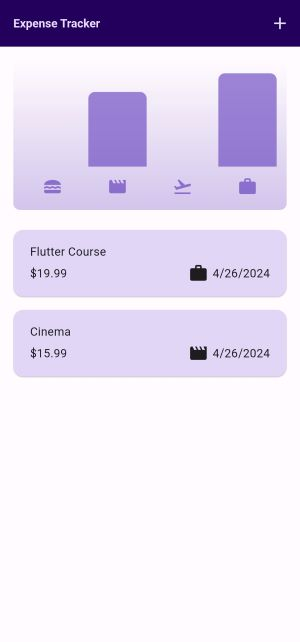

# Flutter Expense Tracker

Welcome to the Flutter Expense Tracker app repository! This Flutter app helps you effortlessly track your expenses, manage your finances, and gain insights into your spending habits. With a sleek and intuitive interface, it's designed to be your go-to tool for staying on top of your finances.

## Features

- **Expense Management**: Easily add, edit, and delete expenses to keep your records up to date.
- **Category-based Tracking**: Categorize your expenses for better organization and analysis.
- **Graphical Representation**: Visualize your expenditure with interactive graphs, offering insights into your spending patterns across different categories.
- **Adaptive Theme**: Seamlessly adapts to the dark or light mode based on your device's theme preferences, ensuring a comfortable user experience.
- **Responsive Design**: Built with Flutter, the app offers a responsive layout that works flawlessly across various screen sizes and orientations.

## Installation

1. **Clone the Repository**: `git clone https://github.com/rajafawady/flutter_expense_tracker.git`
2. **Navigate to the Project Directory**: `cd flutter_expense_tracker`
3. **Install Dependencies**: `flutter pub get`
4. **Run the App**: `flutter run`

## Screenshots

## Contributing

Contributions are welcome! Feel free to open issues or pull requests for any improvements, bug fixes, or new features you'd like to see implemented.

## Acknowledgements

This app was developed with the help of the following open-source libraries and resources:
- [Flutter](https://flutter.dev/)

